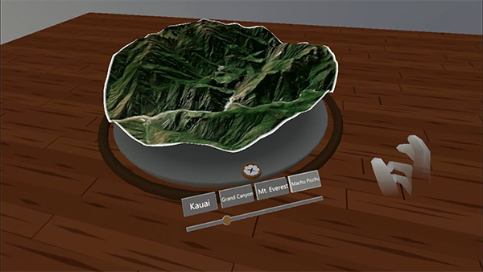

# StereoKit Tutorial - Bing Maps

Displaying map information is pretty cool, and often pretty practical and useful! This project is a quick example of how you might do it from within StereoKit. It includes building 3D terrain using elevation data and satellite imagery, downloading map data from the Bing Maps API, and combining all of that into a widget with some user interface!

While I could have gone wild on adding features, this project is intended as a readable, easy to understand learning resource! It's an example of how to do things, and a good starting point for those that might be interested in creating a similar feature for themselves. It's not meant to be an exhaustive or fully featured product.

## Pre-requisites

This project uses:
- [StereoKit](https://stereokit.net/Pages/Guides/Getting-Started.html)
- [BingMapsRESTToolkit](https://github.com/Microsoft/BingMapsRESTToolkit)
- [A Bing Maps API Key](https://www.bingmapsportal.com/Application)

You will need a Bing Maps API [key of your own](https://www.bingmapsportal.com/Application) to make API requests! It's easy to get one for testing, and the free tier is more than enough to play around with for a while!

This project uses [StereoKit](https://stereokit.net/) to render and drive this as a Mixed Reality application, which allows us to run on HoloLens 2 and VR headsets! We also use the Bing Maps API through the [BingMapsRESTToolkit](https://github.com/Microsoft/BingMapsRESTToolkit), which simplifies interaction with the Bing Maps API. Both of these are included as NuGet packages in the project, though StereoKit also comes with project templates for fast setup!

## Project Layout

Since this is a pretty simple tutorial, there's not a lot of files here! But there are some things to make note of. This solution uses a 2 project setup, one is .Net Core, and one is UWP. Different projects support different features and targets, and I often switch between them based on what I'm working on.

- .Net Core Project
  - WMR VR Desktop
  - Flatscreen Desktop
  - Leap Motion articulated hands
  - No compile time
- UWP Project
  - HoloLens 2 + articulated hands
  - WMR VR Desktop
  - Flatscreen Desktop
  - Controller simulated hands
  - Some compile time

The project consists of 4 code files, a shader file, and a few art assets. The code aims to be very readable, and is also rich with comments to explain less intuitive items.

- [Program.cs](Program.cs)
  - This contains the application and terrain widget logic, it's a great place to begin, to see how the application is all tied together!
- [Geo.cs](Geo.cs)
  - This is a helper file that works with longitude/latitude values. Map APIs use lat/lon for many of their parameters, so it's handy to have a few functions around to do that math for us.
- [BingMaps.cs](BingMaps.cs)
  - This wraps up a pair of calls to get map information from the Bing API! One gets a grid of elevation data, while the other gets satellite imagery for a given region. These calls can be tweaked to get different types of data, like road maps, or map labels.
- [Terrain.cs](Terrain.cs)
  - This is a simplified terrain class! It manages positioning and shader values for chunks of terrain geometry.
- [terrain.hlsl](Assets/terrain.hlsl)
  - This shader turns flat vertex grids into terrain meshes by sampling a height map in the vertex shader, and adjusting the height based on that sample.

## Questions or problems?

If you've got questions about how this works, or how to get it running, let me know over in the Issues tab! Alternatively, you can find me online over on [Twitter - @koujaku](https://twitter.com/koujaku), feel free to send me a note there too!